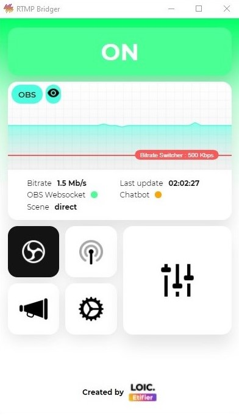

	

# RTMP Bridger

A Windows desktop app that embarcs an rtmp server for IRL streaming, it acts like... well, a bridge between you and your OBS at home.

From wherever you are on the world, share your adventerures on Twitch, Youtube, Facebook or whatever plateform you want, by sending a video stream via RTMP directly to Bridger. Retrieve the images inside OBS and organize your scenes, templates and alerts. When you are ready just go live !

## Features

-   An abstract configuration
-   A graphic user interface accessible from your **desktop**, your **phone** and remotly on the **web**
-   An OBS remote controler to e.g. change the current scene
-   An Event system to handle 4G/5G drops by e.g. automatically switch to a BRB scene
-   A chatbot (Twitch) first to warn you and your viewers in chat of maybe a 4G/5G drops or a scene switch, and second to control and manage all that jazz via several commands while reading the chat

## Installation

Go to the [Release](https://github.com/RoikkuTo/rtmp-bridger/releases) section of this repository and download the RTMP-Bridger-Setup.exe (latest is recommended)

Of course RTMP Bridger is free to use and docs are available in the [_docs_](https://github.com/RoikkuTo/rtmp-bridger/tree/main/docs) folder in english and french.

## Issues

If you encounter any issues or find something that could be improved, you can create [Issues](https://github.com/RoikkuTo/rtmp-bridger/issues) on this repository without any scheme or anything, just make it readable, in english or french.

## Special Thanks

A special thank to Dashi and Trinity, two streamers which have been using RTMP Bridger for more than a year now and without whom this app would never exists, thank you guys !! Go check their content, good stuff.

	

