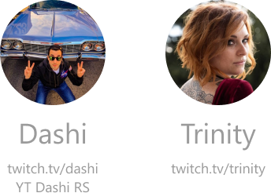

	
	<h1>RTMP Bridger</h1>
	
A free Windows desktop app that embarcs an RTMP server for IRL streaming.

	
	
	
	

 

RTMP Bridger acts like... well, a bridge between you and your OBS at home.

From wherever you are on the world, share your adventerures on Twitch, Youtube, Facebook or whatever plateform you want, by sending a video stream via RTMP directly to Bridger. Retrieve the images inside OBS and organize your scenes, templates and alerts. When you are ready just go live !

## Features

-   **Multi-Camera** compatible, connect at the same as much camera as your PC can handle which is probably **A LOT**
-   An abstract configuration
-   A graphical user interface accessible from your **desktop**, your **phone** and remotly on the **web**
-   An OBS remote controler to e.g. change the current scene
-   An Event system to handle 4G/5G drops by e.g. automatically switch to a BRB scene
-   A chatbot (Twitch) first to warn you and your viewers in chat of maybe a 4G/5G drop or a scene switch, and second to control and manage all that jazz via several commands while reading the chat

 

	

 

## Prerequires

-   Open Broadcast Software Studio (OBS Studio) with the [obs-websocket](https://github.com/Palakis/obs-websocket) installed
-   The ports 80 and three other [ports open](./docs/Network.md#open-my-ports)
-   A [certified domain name](./docs/Network.md#create-a-no-ip-domain-name)

## Installation

Go to the [Release](https://github.com/RoikkuTo/rtmp-bridger/releases) section of this repository and download the RTMP-Bridger-Setup.exe (latest is recommended)

Of course RTMP Bridger is free to use and docs are available in the [_docs_](https://github.com/RoikkuTo/rtmp-bridger/tree/main/docs) folder in english and very soon in french.

## Issues

If you encounter any issues or find something that could be improved, you can create [Issues](https://github.com/RoikkuTo/rtmp-bridger/issues) on this repository without any scheme or anything, just make it readable, in english or french.

## Special Thanks

A special thank to Dashi and Trinity, two streamers which have been using RTMP Bridger for more than a year now and without whom this app would never exists, thank you guys !! Go check their content, good stuff.

	

