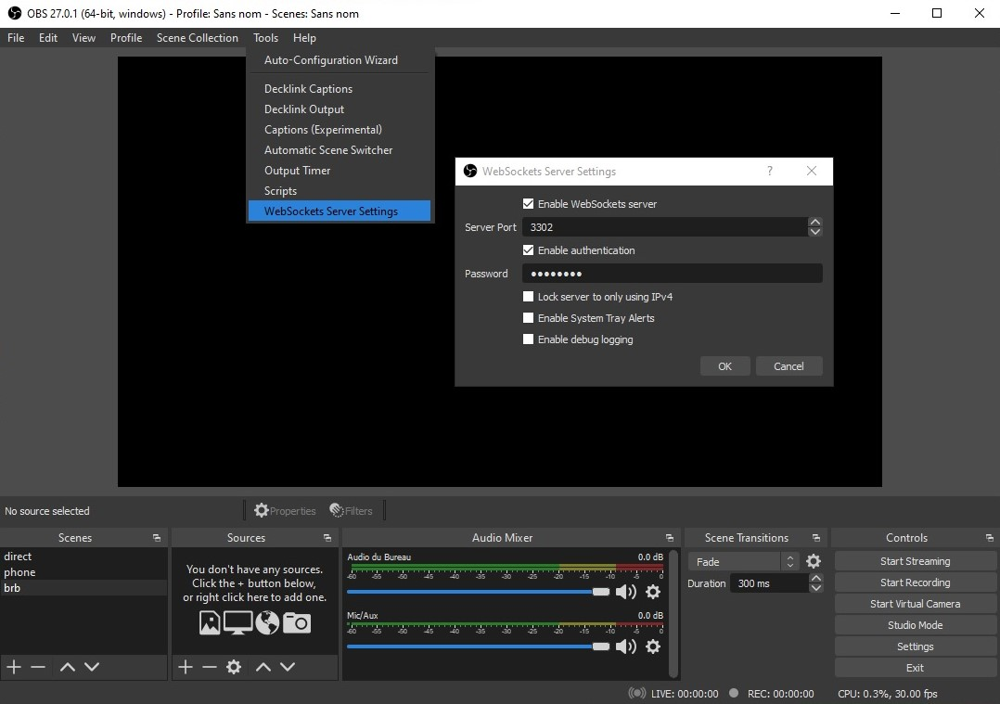

<h1>OBS WebSocket Configuration</h1>

The OBS WebSocket plugin allows us to control your OBS with any apps, in this case RTMP Bridger. To function, OBSWS (OBS WebSocket) needs two things:

-   A free [port](Network.md#open-my-ports), to access the plugin
-   A password, to prevent anybody else other than you to access the plugin and control your OBS

To modify those parameters, on OBS, go to **Tools > Websocket server settings** at the top left :

	

By default, RTMP Bridger uses the port `3302` to access OBS WebSocket. So to change the OBSWS port, type `3302` in the **Server Port** field, just like on the picture above

Then, set a password of your choice in the **Password** field, and you're done !
