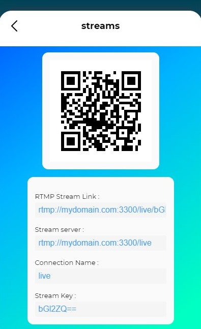

<h1>Stream to the server</h1>

-   [Add a new connection](#add-a-new-connection)
    -   [Use Cases Options](#use-cases-options)
    -   [URL Connection](#url-connection)
-   [Stream with StreamLabs Mobile](#stream-with-streamlabs-mobile)
-   [Stream with Larix Broadcaster (Android / iOS)](#stream-with-larix-broadcaster-android--ios)
-   [Stream with OBS Studio and OBS StreamLabs](#stream-with-obs-studio-and-obs-streamlabs)

## Add a new connection

To connect a new device to the server and send a video/audio stream with it, you need to add that new connection to OBS and put the [URL connection](#url-connection) in your device.

You can do it manually if you want, but using the **New Connection Menu** is the simplest and best way to do it.

-   Go to the **Streams Menu**
-   Then click or tap on the **Plus icon**
-   There is the New Connection menu, select a [use case](#use-cases-options) for the new connection
-   Choose a name for the connection _(whatever you want)_
-   Enter the name of the OBS scene where you want to redirect the stream
-   Add the source and create the scene automatically by checking the box _(pretty explicite)_
-   Generate the QR code

Now you will see that a new OBS source has been added to your OBS. Also a QR Code has been generated so you can share/use the connection URL with any device.

 

	

 

### Use Cases Options

Streaming from the outside using a 4G network isn't the same as streaming on the WI-FI network at home, more specifically the [URL connection](#url-connection) that you will put in your device will not be the same.

So you need to specify in which environment your new connected device will evolve.

-   **Outside** : To stream from outside your house, make sure you have added your external IP, in the Advenced Settings.
-   **Home** : To stream from home, you must be on the same Wi-Fi as your computer. Make sure you have added your local IP, in the Advenced Settings.
-   **Local** : Redirect the stream to another program hosted by your computer e.g. OBS Studio.

> **Note :** If you're not sure about that, don't worry just stick with the Outside option and you are good to go.

### URL Connection

That's how RTMP works basically, an address that tells your device where and to which machin it should connect.

For exemple : `rtmp://mydomain.com/live/1234`

-   `rtmp` is the protocol
-   `mydomain.com` is the domain
-   `live` is the stream or connection name
-   `1234` is the stream key

The generated QR Code return a URL just like this one, to use with any device.

You can get each information like _Stream Name_ or _Stream Key_ independently below the QR Code.

 

	

 

## Stream with StreamLabs Mobile

On RTMP Bridger, [Add a new connection](#add-a-new-connection) and keep the generated infos.

Then in StreamLabs Mobile :

-   Go to Settings
-   Account Settings
-   Select Custom RTMP, the **"Setup"** button
-   In the URL field, paste the **Stream Server** that RTMP Bidger previously gave you
-   In the Stream key field, paste the **Stream Key** that RTMP Bidger previously gave you
-   Tap on **Next** to validate

And you're done, just **GO LIVE** and select Custom RTMP.

## Stream with Larix Broadcaster (Android / iOS)

On RTMP Bridger, [Add a new connection](#add-a-new-connection) and keep the generated infos.

Then in Larix Broadcaster :

-   Go to Settings
-   Connections
-   New Connection
-   Enter a name, whatever you want
-   In the URL field, paste the **RTMP Stream Link** that RTMP Bidger previously gave you
-   Save
-   Check the box beside the your connection

And you're done, just **GO LIVE !**

## Stream with OBS Studio and OBS StreamLabs

On RTMP Bridger, [Add a new connection](#add-a-new-connection) and keep the generated infos.

Then in OBS Studio / OBS StreamLabs Mobile :

-   Go to Settings
-   Stream
-   In the Service field, select **Custom...**
-   In the Server field, paste the **Stream Server** that RTMP Bidger previously gave you
-   In the Stream Key field, paste the **Stream Key** that RTMP Bidger previously gave you
-   Save

And you're done, just **GO LIVE !**
